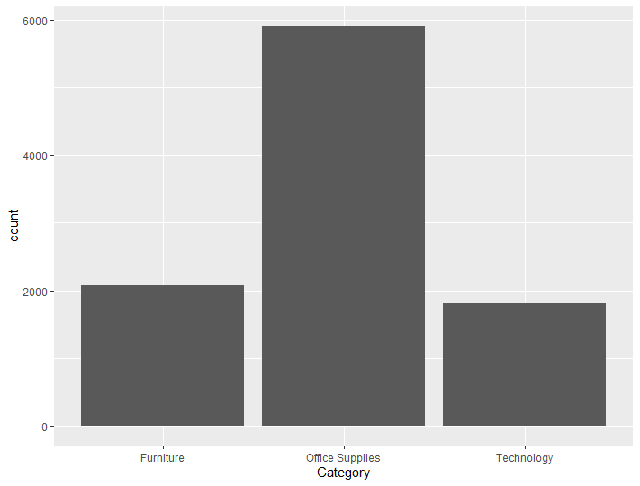

###Choose Dataset:

1. Superstore Sales Dataset (Data from Rohit Sahoo,[Kaggle](https://www.kaggle.com/rohitsahoo/sales-forecasting)) >> [Using CSV](https://raw.githubusercontent.com/safesit23/INT214-Statistics/main/datasets/superstore_sales.csv)

###Outlines
1. Explore the dataset
2. Transform data with dplyr and finding insight the data
3. Visualization with GGplot2

###Part 1: Explore the dataset
```
library("dplyr") 
library("stringr") 
library("tidyr") 
library("assertive") 
library("readr")  

trains <-read.csv("https://raw.githubusercontent.com/safesit23/INT214-Statistics/main/datasets/superstore_sales.csv")

```
Rows: 9800
Columns: 18
```
$ Row.ID        <int> 1, 2, 3, 4, 5, 6, 7, 8, 9, 10, 11, 12, 13, 14, 15, 16, 17, 18, 19, 20, 21, 22, 23, 24, 25, 26, 27, 28, 29, 30, 31, 3~
$ Order.ID      <chr> "CA-2017-152156", "CA-2017-152156", "CA-2017-138688", "US-2016-108966", "US-2016-108966", "CA-2015-115812", "CA-2015~
$ Order.Date    <chr> "08/11/2017", "08/11/2017", "12/06/2017", "11/10/2016", "11/10/2016", "09/06/2015", "09/06/2015", "09/06/2015", "09/~
$ Ship.Date     <chr> "11/11/2017", "11/11/2017", "16/06/2017", "18/10/2016", "18/10/2016", "14/06/2015", "14/06/2015", "14/06/2015", "14/~
$ Ship.Mode     <chr> "Second Class", "Second Class", "Second Class", "Standard Class", "Standard Class", "Standard Class", "Standard Clas~
$ Customer.ID   <chr> "CG-12520", "CG-12520", "DV-13045", "SO-20335", "SO-20335", "BH-11710", "BH-11710", "BH-11710", "BH-11710", "BH-1171~
$ Customer.Name <chr> "Claire Gute", "Claire Gute", "Darrin Van Huff", "Sean O'Donnell", "Sean O'Donnell", "Brosina Hoffman", "Brosina Hof~
$ Segment       <chr> "Consumer", "Consumer", "Corporate", "Consumer", "Consumer", "Consumer", "Consumer", "Consumer", "Consumer", "Consum~
$ Country       <chr> "United States", "United States", "United States", "United States", "United States", "United States", "United States~
$ City          <chr> "Henderson", "Henderson", "Los Angeles", "Fort Lauderdale", "Fort Lauderdale", "Los Angeles", "Los Angeles", "Los An~
$ State         <chr> "Kentucky", "Kentucky", "California", "Florida", "Florida", "California", "California", "California", "California", ~
$ Postal.Code   <int> 42420, 42420, 90036, 33311, 33311, 90032, 90032, 90032, 90032, 90032, 90032, 90032, 28027, 98103, 76106, 76106, 5371~
$ Region        <chr> "South", "South", "West", "South", "South", "West", "West", "West", "West", "West", "West", "West", "South", "West",~
$ Product.ID    <chr> "FUR-BO-10001798", "FUR-CH-10000454", "OFF-LA-10000240", "FUR-TA-10000577", "OFF-ST-10000760", "FUR-FU-10001487", "O~
$ Category      <chr> "Furniture", "Furniture", "Office Supplies", "Furniture", "Office Supplies", "Furniture", "Office Supplies", "Techno~
$ Sub.Category  <chr> "Bookcases", "Chairs", "Labels", "Tables", "Storage", "Furnishings", "Art", "Phones", "Binders", "Appliances", "Tabl~
$ Product.Name  <chr> "Bush Somerset Collection Bookcase", "Hon Deluxe Fabric Upholstered Stacking Chairs, Rounded Back", "Self-Adhesive A~
$ Sales         <dbl> 261.9600, 731.9400, 14.6200, 957.5775, 22.3680, 48.8600, 7.2800, 907.1520, 18.5040, 114.9000, 1706.1840, 911.4240, 1~
```
Part 2: Transform data with dplyr and finding insight the data
##1. ค่าเฉลี่ยของSales
```
mean(trains$Sales)
```
Result
```
[1] 230.7691

```
ค่าเฉลี่ยของsalesคืแ230.7691
##2. ในsub category มีอะไรบ้าง
```
trains%>%select(Sub.Category)%>%distinct()
```
Result
```
Sub.Category
1     Bookcases
2        Chairs
3        Labels
4        Tables
5       Storage
6   Furnishings
7           Art
8        Phones
9       Binders
10   Appliances
11        Paper
12  Accessories
13    Envelopes
14    Fasteners
15     Supplies
16     Machines
17      Copiers
```
sub category เช่น Bookcases Labels Tables เป็นต้น
##3. หาชื่อสินค้าและราคาราคาที่ขายมากที่สุด
```
trains%>%select(Product.Name,Sales)%>%filter(Sales == max(Sales))
```
Result
```
Product.Name                                              Sales
1 Cisco TelePresence System EX90 Videoconferencing Unit   22638.48
```
สินค้าที่ขายราคามากที่สุดคือ Cisco TelePresence System EX90 Videoconferencing Unit ราคา 22638.48
##4.Stateไหนที่สินค้าเข้ามากที่สุดและจำนวนเท่าไหร่
```
train<-trains%>%select(State)%>%count(State)
train%>%select(State,n)%>%filter(n == max(train$n))
```
Result
```
    State     n
1 California 1946
```
California มีสินค้าเข้ามากที่สุดจำนวน1946
##5. Stateไหนมีสินค้าเข้าแค่1
```
train%>%select(State,n)%>%filter(n == 1)
```
Result
```
State n
1 Wyoming 1
```
Wyomingมีสินค้าเข้า1
##6. สินค้าModeไหนมีเท่าไหร
```
trains%>%select(Ship.Mode)%>%count(Ship.Mode)
```
Result
```
Ship.Mode    n
1    First Class 1501
2       Same Day  538
3   Second Class 1902
4 Standard Class 5859
```
First class มี 1501
Same Dat มี 538
Second Class มี 1902
Standard Class มี 5859
###Part 4: Visualization with GGplot2
##1.) Graph show relation Number of Category
```
ggplot(trains,aes(x=Category)) + geom_bar()
```
Result

##2.) Graph show relation between sale and sub category
```
ggplot(trains , aes(x="", y=Sales, fill=Sub.Category)) +
  geom_bar(stat="identity", width=1) +
  coord_polar("y", start=0)
```
Result


[PowerBI](#)